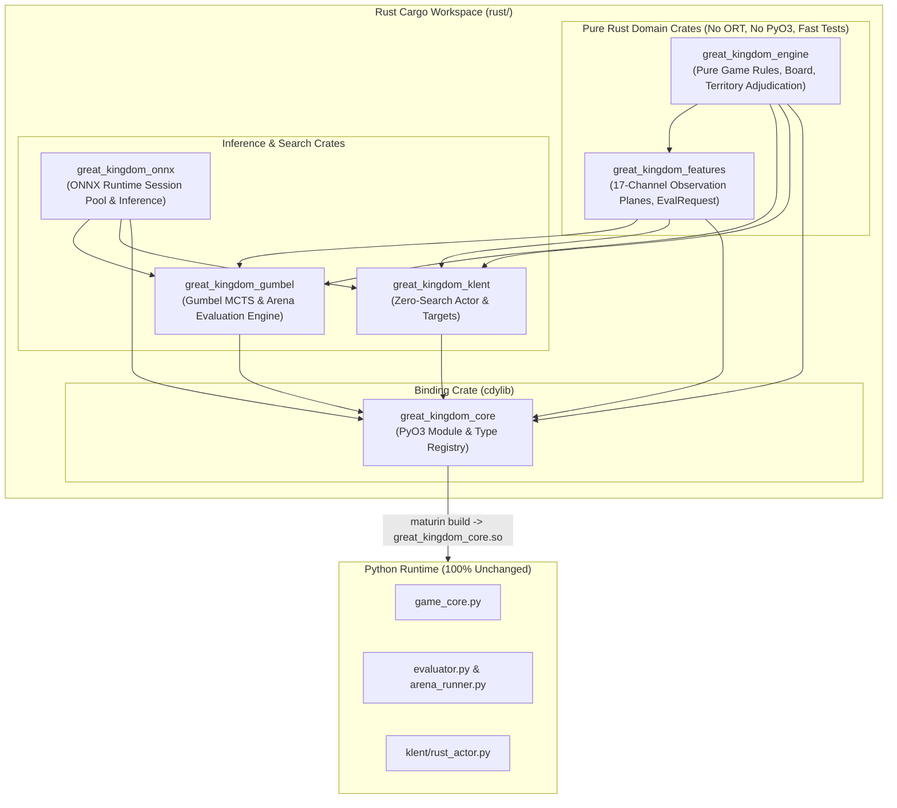

# Cargo Workspace Refactoring Plan (Zero-Regression Specification)

## 1. Executive Summary & Goals

### 1.1 Background
The repository currently hosts its entire Rust acceleration layer in a single monolithic crate: `rust/great_kingdom_core`. This crate bundles:
- Core board game logic, territory scoring, and rule adjudication (`game`, `rules`, `territory`).
- Neural network board observation and feature tensor projection (`features`, `eval_request`).
- ONNX Runtime session pooling and batched tensor evaluation (`onnx`).
- Gumbel AlphaZero MCTS search and batched arena evaluation (`gumbel`).
- KLENT zero-search batched self-play actor and analytical policy/value calculations (`klent`).
- PyO3 Python C-extension bindings (`lib.rs`).

### 1.2 Motivation
1. **Adherence to Project Rules ([`AGENTS.md`](../AGENTS.md))**:
   - **Testability (*테스트가 용이한 구조*)**: Game rules and feature extraction currently cannot be tested in isolation without pulling in the heavy `ort` (ONNX Runtime) dependency and C++ dynamic libraries.
   - **Modifiability (*수정이 용이한 구조*)**: Strict domain boundaries ensure that changing machine learning representations (e.g., modifying feature channels or auxiliary targets) never touches pure game rules.
   - **Concise File Structure (*파일 하나가 쓸데없이 크지 않은 구조*)**: Splitting responsibilities into dedicated domain crates prevents monolithic build bloat.
2. **Domain-Driven Separation of Concerns (Game Physics vs. ML Observation)**:
   - **Game Engine**: Pure simulation rules (board representation, move legality, liberties, suicide/ko rules, territory scoring). It has zero conceptual coupling to neural networks, tensors, or channels.
   - **Feature Extraction**: Machine learning representation engineering (17-channel observation planes, legal action masks, batch tensor aggregation). Separating this allows rapid feature experiments without risking game rule integrity.
3. **Developer Environment Optimization**:
   - **Office Laptop (Local dev, no GPU, CPU only)**: Developers editing game rules or feature extraction can run `cargo test` in sub-second time without downloading ONNX binaries or linking CUDA.
   - **RunPod (RTX 3090, CUDA 12.4)**: Training and evaluation require optimized GPU inference via `ort/cuda` and single-command `maturin` builds.

### 1.3 Strict Zero-Regression Constraint
> [!IMPORTANT]
> **Zero Functional Regression**: Absolutely no Python APIs, CLI flags, configuration parameters, or runtime behaviors may be broken or modified.
> - The compiled Python extension module **must remain named `great_kingdom_core`**.
> - All classes (`GameState`, `EvalRequest`, `GumbelConfig`, `GumbelResult`, `GumbelSearch`, `GumbelSelfPlayBatch`, `GumbelArenaBatch`, `OnnxEvaluator`, `KlentZeroSearchBatch`), functions (`action_space`, `rayon_thread_count`, `klent_analytical_policy`, `klent_masked_state_value`), and constants (`BOARD_SIZE`, `BOARD_CELLS`, `PASS_ACTION`, `FEATURE_CHANNELS`) must be exported at the root module level with identical signatures.
> - Build commands in [`scripts/setup_runpod.sh`](../scripts/setup_runpod.sh) and operational instructions in [`docs/runpod-klent-training.md`](runpod-klent-training.md) must continue to work without modification.

---

## 2. Architecture & Workspace Topology

### 2.1 Why a Single PyO3 cdylib Over Multiple Python Wheels
Splitting the system into multiple independent Python wheels/extensions (e.g., `great_kingdom_engine.so`, `great_kingdom_gumbel.so`, etc.) is strongly discouraged due to fundamental C-extension limitations:
1. **PyO3 Cross-Module ABI Incompatibility**: Rust structs exposed as `#[pyclass]` in one `.so` cannot be directly unwrapped as native Rust types in another `.so`. Passing a `GameState` from an engine extension to a Gumbel/KLENT extension would require unsafe `PyCapsule` FFI or serializing via Python objects, severely degrading turn-by-turn performance.
2. **ONNX Runtime Dynamic Library Symbol Collisions**: Loading multiple C-extensions that each link `ort` / `libonnxruntime.so` into the same Python process easily triggers C++ One Definition Rule (ODR) violations and non-deterministic `Segmentation Fault (core dumped)`.
3. **Multiplied Build & Link Complexities**: Each extension would need separate `maturin develop` invocations, complicating RunPod CUDA path management.

### 2.2 The Solution: Cargo Workspace with Single PyO3 Facade
We decouple the Rust codebase into **five internal domain crates** and **one PyO3 facade crate**, unified under a top-level Cargo Workspace.



---

## 3. Crate Specifications & Separation of Concerns

### 3.1 `crates/great_kingdom_engine`
* **Domain**: Pure game rules and board physics.
* **Responsibilities**: Board representations, move legality, liberties, capture resolution, eye detection, suicide/ko rules, and territory scoring.
* **Dependencies**: `rayon = "1.12"`. **Zero PyO3, Zero ORT, Zero Tensor/ML representations.**
* **Source Files**:
  - `game.rs`: `GameState`, `Action`, `Cell`, `Player`, `GameOutcome`, `GameEndReason`, board constants (`BOARD_SIZE`, `BOARD_CELLS`, `PASS_ACTION`, `CASTLES_PER_PLAYER`).
  - `rules.rs`: Territory scoring, eye detection, suicide/ko rules.
  - `territory.rs`: Flood-fill territory ownership and eye classification.
  - `lib.rs`: Exports core engine primitives.
* **Key Benefits**:
  - 100% pure game simulator. Completely decoupled from machine learning concepts.
  - Compiles in <1 second; fast unit testing via `cargo test -p great_kingdom_engine`.

### 3.2 `crates/great_kingdom_features`
* **Domain**: Machine learning state observation and feature engineering.
* **Responsibilities**: Converting pure game states into 17-channel neural network input planes, legal action masks, and batched evaluation request containers.
* **Dependencies**:
  - `great_kingdom_engine = { path = "../great_kingdom_engine" }`
  - `rayon = "1.12"`
  - **Zero ORT, Zero PyO3.**
* **Source Files**:
  - `features.rs`: 17-channel board feature tensor projection (`FeatureChannel`, `feature_planes_array`, `legal_action_mask`), constant `FEATURE_CHANNELS = 17`.
  - `eval_request.rs`: `EvalRequest` data structure aggregating states, feature byte buffers, and legal masks for batched model forward passes.
  - `lib.rs`: Exports observation and evaluation request types.
* **Key Benefits**:
  - Allows iterating on model observation representations without touching game rules.
  - Fast unit tests via `cargo test -p great_kingdom_features` without any C++ dynamic libraries.

### 3.3 `crates/great_kingdom_onnx`
* **Domain**: Deep learning inference infrastructure.
* **Responsibilities**: Thread-safe ONNX Runtime session pool management, hardware device resolution (CPU / CUDA), dynamic batching, and tensor transformation.
* **Dependencies**:
  - `great_kingdom_engine = { path = "../great_kingdom_engine" }`
  - `great_kingdom_features = { path = "../great_kingdom_features" }`
  - `ort = { version = "=2.0.0-rc.10", default-features = false, features = ["copy-dylibs", "download-binaries", "ndarray", "std"] }`
  - `rayon = "1.12"`
* **Features**:
  - `default = []`
  - `cuda = ["ort/cuda"]`
* **Source Files**:
  - `evaluator.rs`: `OnnxEvaluator`, `OnnxEvaluatorConfig`, `NetworkOutput`, `OnnxDevice`.
  - `profile.rs`: Inference latency and throughput telemetry.

### 3.4 `crates/great_kingdom_gumbel`
* **Domain**: Tree search and model evaluation algorithms.
* **Responsibilities**: Gumbel AlphaZero MCTS search engine, sequential halving tree search, and batched head-to-head arena evaluation.
* **Dependencies**:
  - `great_kingdom_engine = { path = "../great_kingdom_engine" }`
  - `great_kingdom_features = { path = "../great_kingdom_features" }`
  - `great_kingdom_onnx = { path = "../great_kingdom_onnx" }`
  - `rayon = "1.12"`
* **Features**:
  - `default = []`
  - `cuda = ["great_kingdom_onnx/cuda"]`
* **Source Files**:
  - `config.rs`: `GumbelConfig`.
  - `search.rs`: `GumbelSearch`, `GumbelEvalBatch`.
  - `arena_batch.rs`: `GumbelArenaBatch` (high-throughput parallel arena evaluator).
  - `batch.rs`: `GumbelSelfPlayBatch`.
  - `sequential_halving.rs`, `selection.rs`, `sampling.rs`, `root.rs`, `node.rs`, `result.rs`, `policy.rs`, `profile.rs`, `debug.rs`.
  - `rng.rs`: `SplitMix64` (PRNG).

### 3.5 `crates/great_kingdom_klent`
* **Domain**: Zero-search self-play collection and regularized policy targets.
* **Responsibilities**: KLENT zero-search batched self-play collector, closed-form soft policy targets ($\pi'$), and analytical state value calculations.
* **Dependencies**:
  - `great_kingdom_engine = { path = "../great_kingdom_engine" }`
  - `great_kingdom_features = { path = "../great_kingdom_features" }`
  - `great_kingdom_onnx = { path = "../great_kingdom_onnx" }`
  - `rayon = "1.12"`
* **Features**:
  - `default = []`
  - `cuda = ["great_kingdom_onnx/cuda"]`
* **Source Files**:
  - `batch.rs`: `KlentZeroSearchBatch` implementation (owns game state vector, samples $\pi'$, records shard trajectories).
  - `targets.rs`: Closed-form $\pi'$ target calculation (`klent_analytical_policy`) and masked state value calculation (`klent_masked_state_value`).
  - `rng.rs`: Dedicated PRNG instance (decoupling from Gumbel internals).

### 3.6 `crates/great_kingdom_core` (PyO3 Facade)
* **Domain**: Python extension boundary and C-API bindings.
* **Responsibilities**: Aggregating all domain crates and exporting classes, functions, and constants to Python under the `great_kingdom_core` module.
* **Dependencies**:
  - `great_kingdom_engine = { path = "../great_kingdom_engine" }`
  - `great_kingdom_features = { path = "../great_kingdom_features" }`
  - `great_kingdom_onnx = { path = "../great_kingdom_onnx" }`
  - `great_kingdom_gumbel = { path = "../great_kingdom_gumbel" }`
  - `great_kingdom_klent = { path = "../great_kingdom_klent" }`
  - `pyo3 = { version = "0.25" }`
* **Features**:
  - `default = []`
  - `extension-module = ["pyo3/extension-module"]`
  - `onnx-cuda = ["great_kingdom_onnx/cuda", "great_kingdom_gumbel/cuda", "great_kingdom_klent/cuda"]`
* **Source Files**:
  - `lib.rs`: Defines `#[pymodule] fn great_kingdom_core(...)`. Exposes all existing classes and functions directly at module level, plus optional namespaced submodules (`engine`, `features`, `onnx`, `gumbel`, `klent`).

---

## 4. Directory Layout

```
rust/
├── Cargo.toml                          # Workspace root
├── Cargo.lock
└── crates/
    ├── great_kingdom_engine/           # Pure Game Rules & Board Physics
    │   ├── Cargo.toml
    │   └── src/
    │       ├── game.rs
    │       ├── lib.rs
    │       ├── rules.rs
    │       └── territory.rs
    ├── great_kingdom_features/         # ML Observation & Feature Engineering
    │   ├── Cargo.toml
    │   └── src/
    │       ├── eval_request.rs
    │       ├── features.rs
    │       └── lib.rs
    ├── great_kingdom_onnx/             # ONNX Runtime Session Pool
    │   ├── Cargo.toml
    │   └── src/
    │       ├── evaluator.rs
    │       ├── lib.rs
    │       └── profile.rs
    ├── great_kingdom_gumbel/           # Gumbel MCTS & Arena Evaluator
    │   ├── Cargo.toml
    │   └── src/
    │       ├── arena_batch.rs
    │       ├── batch.rs
    │       ├── config.rs
    │       ├── lib.rs
    │       ├── rng.rs
    │       ├── search.rs
    │       └── ...
    ├── great_kingdom_klent/            # KLENT Zero-Search Actor & Targets
    │   ├── Cargo.toml
    │   └── src/
    │       ├── batch.rs
    │       ├── lib.rs
    │       ├── rng.rs
    │       └── targets.rs
    └── great_kingdom_core/             # PyO3 Bridge Crate (maturin build root)
        ├── Cargo.toml
        ├── pyproject.toml              # Maturin package specification
        └── src/
            └── lib.rs                  # Python extension entry point
```

---

## 5. Backward Compatibility & Verification Matrix

### 5.1 Python API Compatibility Matrix
Every single export currently present in `great_kingdom_core` will be mapped to the facade crate:

| Export Name | Original Location | New Originating Crate | Exported via `great_kingdom_core` |
|---|---|---|---|
| `GameState` | `src/game.rs` | `great_kingdom_engine` | Direct root export + `core.engine.GameState` |
| `BOARD_SIZE` | `src/game.rs` | `great_kingdom_engine` | Constant root export |
| `BOARD_CELLS` | `src/game.rs` | `great_kingdom_engine` | Constant root export |
| `PASS_ACTION` | `src/game.rs` | `great_kingdom_engine` | Constant root export |
| `action_space()` | `src/lib.rs` | `great_kingdom_engine` | Function root export |
| `EvalRequest` | `src/eval_request.rs` | `great_kingdom_features` | Direct root export + `core.features.EvalRequest` |
| `FEATURE_CHANNELS` | `src/game.rs` | `great_kingdom_features` | Constant root export |
| `rayon_thread_count()` | `src/lib.rs` | `great_kingdom_core` | Function root export |
| `OnnxEvaluator` | `src/onnx/evaluator.rs` | `great_kingdom_onnx` | Direct root export + `core.onnx.OnnxEvaluator` |
| `GumbelConfig` | `src/gumbel/config.rs` | `great_kingdom_gumbel` | Direct root export + `core.gumbel.GumbelConfig` |
| `GumbelResult` | `src/gumbel/result.rs` | `great_kingdom_gumbel` | Direct root export + `core.gumbel.GumbelResult` |
| `GumbelSearch` | `src/gumbel/search.rs` | `great_kingdom_gumbel` | Direct root export + `core.gumbel.GumbelSearch` |
| `GumbelSelfPlayBatch` | `src/gumbel/batch.rs` | `great_kingdom_gumbel` | Direct root export + `core.gumbel.GumbelSelfPlayBatch` |
| `GumbelArenaBatch` | `src/gumbel/arena_batch.rs` | `great_kingdom_gumbel` | Direct root export + `core.gumbel.GumbelArenaBatch` |
| `KlentZeroSearchBatch` | `src/klent/mod.rs` | `great_kingdom_klent` | Direct root export + `core.klent.KlentZeroSearchBatch` |
| `klent_analytical_policy()` | `src/klent/mod.rs` | `great_kingdom_klent` | Function root export |
| `klent_masked_state_value()` | `src/klent/mod.rs` | `great_kingdom_klent` | Function root export |

### 5.2 Build Script (`scripts/setup_runpod.sh`) Compatibility
In [`scripts/setup_runpod.sh`](../scripts/setup_runpod.sh#L7):
```bash
# Current pointer:
RUST_CRATE_DIR="$ROOT_DIR/rust/great_kingdom_core"
```
Under the workspace structure, `rust/great_kingdom_core` (or `rust/crates/great_kingdom_core`) contains the PyO3 crate and `pyproject.toml`.

The maturin build command remains completely identical:
```bash
python -m maturin develop --release --features extension-module,onnx-cuda
```

---

## 6. Phased Implementation Plan

### Phase 1: Workspace Initialization & `great_kingdom_engine`
1. Initialize the root `rust/Cargo.toml` with `[workspace]`.
2. Extract pure game rules, board state, and territory adjudication into `crates/great_kingdom_engine`.
3. Verify pure engine unit tests:
   ```bash
   cargo test -p great_kingdom_engine
   ```
   *Expected result: Ultra-fast compilation (<1s) and 100% test pass with zero ML/ORT dependencies.*

### Phase 2: Extract `great_kingdom_features`
1. Move 17-channel feature projection and `EvalRequest` into `crates/great_kingdom_features`.
2. Add dependency on `great_kingdom_engine`.
3. Verify feature extraction tests:
   ```bash
   cargo test -p great_kingdom_features
   ```
   *Expected result: Fast unit tests validating feature tensor shapes and masks with zero C++ dynamic libraries.*

### Phase 3: Extract `great_kingdom_onnx`
1. Move `onnx/` session management into `crates/great_kingdom_onnx`.
2. Add `great_kingdom_engine`, `great_kingdom_features`, and `ort` dependencies.
3. Configure optional `cuda = ["ort/cuda"]` feature.

### Phase 4: Extract `great_kingdom_gumbel` & `great_kingdom_klent`
1. Move Gumbel MCTS and Arena batch implementation into `crates/great_kingdom_gumbel`.
2. Move KLENT zero-search batch and closed-form target calculations into `crates/great_kingdom_klent`.
3. Decouple PRNG by providing dedicated `SplitMix64` instances.

### Phase 5: Construct PyO3 Facade Crate (`great_kingdom_core`)
1. Create `great_kingdom_core` crate implementing the `#[pymodule]` facade.
2. Bind and re-export types, functions, and constants from all five domain crates.
3. Verify backward compatibility with the existing Python test suite:
   ```bash
   maturin develop --features extension-module
   pytest tests/
   ```

### Phase 6: Verification & Zero-Regression Sign-Off
1. **CPU Smoke Test**: Run [`scripts/run_klent_smoke.py`](../scripts/run_klent_smoke.py) on office laptop.
2. **GPU CUDA Parity Test**: Run RunPod smoke test and verify `KlentZeroSearchBatch` and `GumbelArenaBatch` with CUDA inference.
3. **Arena Sanity Test**: Verify head-to-head evaluation via `great-kingdom-evaluate`.
