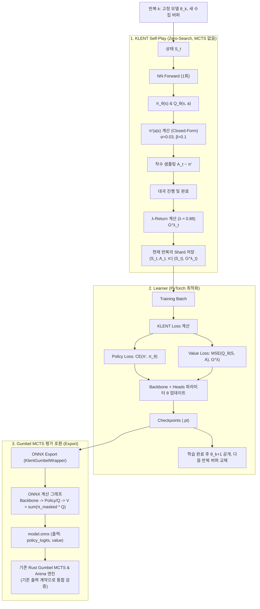

# KLENT 학습 파이프라인 및 Gumbel MCTS 호환 연동 구현 계획

Runpod 설치·사전 실행·본 학습·재개·shard 보관 방법은
[KLENT 실행 매뉴얼](runpod-klent-training.md)을 참고한다.

본 계획서는 **KLENT(Revisiting Regularized Policy Optimization for Stable and Efficient Reinforcement Learning in Two-Player Games, ICML 2026)** 논문의 핵심 알고리즘을 도입하여, 다음 두 가지 요구사항을 구현하고 검증하는 절차를 정의합니다. 기준 알고리즘은 [논문 v2 §4.3 및 Algorithm 1](https://arxiv.org/html/2602.10894v2#S4.SS3)이며, 로컬 참고 자료는 [klent.pdf](klent.pdf)입니다.

1. **KLENT 방식의 Self-Play 파이프라인**: MCTS 없는 Zero-Search 셀프플레이, $\pi'$ closed-form 소프트 타깃 및 $\lambda$-Return 가치 학습.
2. **학습된 모델의 Gumbel MCTS 활용**: $V(s) = \langle \pi(\cdot\mid s), Q(\cdot\mid s) \rangle$ 결합을 통해 기존 Rust Gumbel Search 엔진의 입력·출력 계약을 유지하고 Arena 평가로 호환성을 검증.

---

## 1. 아키텍처 개요

기존 코드베이스의 안정성을 유지하고, [규칙(`AGENTS.md`)](../AGENTS.md)의 **테스트 용이성 / 수정 용이성 / 파일 크기 최소화**를 준수하기 위해 KLENT 관련 코드는 독립된 전용 패키지(`great_kingdom_ai/klent/`)로 모듈화합니다.



---

## 2. 세부 구현 컴포넌트 명세

### (1) 모델 아키텍처 확장 ([`model.py`](../python/great_kingdom_ai/model.py))
- **목표**: Shared-backbone 기반으로 정책 로짓 $z_\theta(s) \in \mathbb{R}^{|A|}$과 행동-가치 $Q_\theta(s, a) \in \mathbb{R}^{|A|}$를 동시 출력.
- **설계**:
  - **베이스 프리셋 고정**: `strong_attn`(128채널, residual 10, attention 2)만 사용한다. `strong_clean` 등 다른 프리셋은 KLENT 베이스로 사용하지 않는다.
  - `ModelConfig`에 `action_value_head: bool = False` 옵션 추가. 논문 Table 4와 동일하게 `action_value_head=True`이면 state-value head는 생성하지 않는다.
  - 기존 `policy_spatial` / `policy_pass`와 대칭되는 `q_spatial` / `q_pass` 구조를 갖추고 최종 활성화 함수로 `nn.Tanh()` 적용 ($[-1, 1]$ 승패 보상 스케일 매핑, $\lambda$-return도 $[-1, 1]$로 유계).
  - 메서드 확장:
    - `forward(x)`: 기존과 동일하게 `(policy_logits, value)`를 반환하여 호출부(`training/loop.py:112`, `evaluator.py:245`, `onnx_export.py:153`)와 반환 시그니처를 유지한다. KLENT 학습은 반드시 별도 Q 손실 경로를 사용한다. Q-head 모델에서 `value`는 legal action만 마스킹한 $V(s) = \sum_a \text{softmax}(\pi_{\text{mask}})_a \cdot Q_a$ (rank-1 `[B]` 유지).
    - `forward_q(x)`: `(policy_logits, q_values)`를 반환. KLENT self-play의 $\pi'$ 계산과 Q 손실 전용.
  - **불법수 마스킹 (필수)**: 현재 정책 손실은 `masked_fill`로 불법 로짓에 gradient를 주지 않으므로(`training/loop.py:114-118`) 불법 Q/로짓은 미학습 값이다. 따라서 $V$ 계산 시 입력 features의 `LEGAL_PLACE_FEATURE_CHANNEL=4`(`features.py:19`)에서 legal mask를 재구성하고(비종료 상태에서 패스는 항상 legal, `rules.rs`) `-inf`/`finfo.min` 마스킹 후 softmax를 적용한다. 이로써 Rust 입력 계약(features만)을 변경하지 않고 그래프 내 $V$를 legal-masked 정책의 Q 기댓값으로 정의한다. 종료 상태는 환경 보상으로 처리하고 네트워크 평가 대상에서 제외한다.

### (2) KLENT 전용 타깃 및 손실 함수 모듈 (`python/great_kingdom_ai/klent/`)
독립된 서브패키지를 생성하여 단위 테스트가 완전히 독립적으로 수행되도록 합니다.

- **`klent/types.py`**:
  - `KlentConfig(alpha=0.03, beta=0.1, lambda_param=0.8825, ...)`
- **`klent/targets.py`**:
  - `compute_analytical_policy(policy_logits, q_values, legal_mask, alpha, beta) -> Tensor`:
    $$\pi'(a \mid s) = \text{softmax}\left( \frac{Q(s, a) + \beta \log \pi(a \mid s)}{\alpha + \beta} \right)$$
    정책은 legal action에 대해서만 정규화한다. 타깃 생성은 `eval()` 및 `no_grad`에서 수행하고 저장 전에 detach한다. AMP 사용 시에도 타깃의 log-softmax, 정규화, 기댓값과 return 계산은 FP32로 수행한다.
    - `alpha >= 0`, `beta >= 0`, `alpha + beta > 0`, `lambda_param ∈ [0, 1]`, `gamma ∈ [0, 1]` 및 유한성을 검증한다. 기준 실험은 `gamma=1`이다.
    - 불법수의 결과 확률은 정확히 0이어야 한다. `beta=0`일 때 `0 × -inf`가 생기지 않도록 legal 로짓에서 계산한 뒤 마스킹한다. legal action이 없는 입력은 오류로 처리한다.
    - `legal_mask_from_features`, `masked_state_value`는 학습 루프에 의존하지 않는 텐서 헬퍼로 두어 모델·export·self-play가 공유한다.
  - `compute_lambda_returns(rewards, state_values, players, lambda_param, gamma=1.0) -> Tensor`:
    종료 보상 $R_T$ 및 각 상태 추정 가치 $\hat{v}_t = \mathbb{E}_{\pi'}[Q(S_t, A)]$로부터 역방향(backward) TD($\lambda$) 리턴 계산.
    - **보상·인덱스 계약**: `T`는 마지막 착수의 인덱스이며, 배열 길이는 모두 `T+1`이다. `r_t`는 `S_t`에서 `A_t`를 실행한 보상으로, `players[t]` 시점이다. 비종료 착수의 보상은 0, 마지막 착수의 보상은 승자와 `players[T]`를 비교한 ±1이다. 종료 상태 `S_{T+1}`의 예측값은 필요하지 않다.
    - **2인 제로섬 부호 변환**: $c_t=+1$ if `players[t] == players[t+1]`, otherwise $c_t=-1$로 두고 다음과 같이 계산한다.
      $$G^\lambda_T=r_T,\qquad G^\lambda_t=r_t+\gamma c_t\left[(1-\lambda)\hat v_{t+1}+\lambda G^\lambda_{t+1}\right]\quad(0\le t<T)$$
      종료 보상은 마지막 착수에서 한 번만 넣는다. 게임 종료 후 `current_player` 값으로 마지막 착수자의 시점을 추정하지 않는다.
    - 비종료 보상 0, 종료 보상 ±1, 유계 Q와 위 계수 범위에서 $G^\lambda\in[-1,1]$이다. clipping으로 부호·인덱스 오류를 숨기지 않는다. 길이 제한으로 중단된 대국은 정상 종료 타깃으로 저장하지 않고 오류로 보고한다.
- **`klent/loss.py`**:
  - `compute_klent_losses(model, batch, config) -> KlentLossBreakdown`:
    1. **Policy Loss**: $\mathcal{L}_{\pi} = -\sum_{a \in \mathcal{A}} \pi'(a \mid S) \log \pi_\theta(a \mid S)$ (Soft target Cross Entropy)
    2. **Q-Value Loss**: $\mathcal{L}_{Q} = \left( Q_\theta(S, A) - G^\lambda \right)^2$ (실제 취한 행동 $A$에 대해서만 `gather` 후 MSE)
  - **안전한 CE**: 불법 항의 log probability를 곱셈 전에 0으로 치환하거나 legal 항만 선택해 합산한다. `0 × -inf`를 계산한 뒤 마스킹하는 방식은 금지한다. CE 및 MSE 집계는 FP32로 수행하고 타깃으로 gradient가 흐르지 않게 한다.
  - 초기 loss 가중치는 policy/Q 각각 1이다. 기존 AlphaZero의 추가 엔트로피·value loss·reanalyze·보조 loss가 자동으로 적용되지 않도록 모드를 명시적으로 분리한다.
  - **배치 스키마 확장 (필수)**: Q 손실에는 실제 취한 행동 $A$가 필요하므로 `TrajectoryArrayBatch`/`TrainingBatch`/`TrainingArrays`/`ReplaySample`에 `action` 필드를 추가하고 `replay.actions`에서 공급한다(`replay/dataset.py::sample_arrays`). `augmentation.py`의 D4 변환 시 `policy`와 동일한 규칙으로 action 인덱스도 함께 permute해야 한다.

### (3) Gumbel MCTS 평가용 ONNX Export ([`onnx_export.py`](../python/great_kingdom_ai/onnx_export.py))
- **핵심 아이디어**:
  - Rust의 [`OnnxEvaluator`](../rust/great_kingdom_core/src/onnx/evaluator.rs)와 [`GumbelSearch`](../rust/great_kingdom_core/src/gumbel/search.rs)는 ONNX의 `"policy_logits"`와 `"value"` 텐서를 읽습니다.
  - Export 시 모델 끝단에 **legal action만 마스킹한** $V(s) = \langle \text{softmax}(\pi_{\text{mask}}), Q \rangle$ 노드를 그래프에 결합하는 `KlentGumbelExportWrapper`를 둡니다. 불법수 Q/로짓은 학습되지 않으므로 반드시 마스킹해야 합니다.
  ```python
  from great_kingdom_ai.klent.targets import legal_mask_from_features, masked_state_value

  class KlentGumbelExportWrapper(nn.Module):
      def __init__(self, klent_model: nn.Module):
          super().__init__()
          self.model = klent_model

      def forward(self, features: torch.Tensor) -> tuple[torch.Tensor, torch.Tensor]:
          policy_logits, q_values = self.model.forward_q(features)
          legal_mask = legal_mask_from_features(features)  # 채널 4 + pass(항상 legal)
          value = masked_state_value(policy_logits, q_values, legal_mask)  # rank-1 [B]
          return policy_logits, value  # export output_names는 policy_logits, value로 지정
  ```
  - `masked_state_value`는 모델 `forward`의 Q-head 분기와 동일한 텐서 헬퍼를 사용해 PyTorch/ONNX 간 parity를 보장합니다.
  - `value`는 기존 export와 동일한 rank-1 `[B]`로 유지합니다. Rust `OnnxEvaluator`는 원소 수만 검사하므로 `[B, 1]`도 통과하지만, `compare_checkpoint_to_onnx`의 rank-1 검사(`onnx_export.py:159-162`)를 깨지 않기 위함입니다.
- **호환성 검증 목표**:
  - 기존 Rust Gumbel 검색 알고리즘과 2출력 evaluator 계약을 유지한다. 실제 로드, 추론, Arena 대국으로 검증한다.
  - export의 `policy_logits`는 불법 항도 유한한 원본 로짓으로 반환한다. Rust evaluator의 유한성 검사와 충돌하는 `-inf`를 외부 출력으로 내보내지 않는다.
  - $V_{eval}=E_{π}[Q]$는 평가용 정의이고, 학습 bootstrap의 $\hat v=E_{π'}[Q]$와 다르다. Actor는 export의 `value`를 λ-return bootstrap으로 사용하지 않는다.
  - 텐서 계약 호환성이 검색 기력 향상을 보장하지 않는다. CPU FP32 parity 이후 Runpod FP16 오차와 지연을 측정하고, 검색 없는 평가와 Gumbel 평가를 비교한다. 추가 연산의 비용은 실측한다.

### (4) KLENT Self-Play 구현 (Python & Rust)
- **Phase 1: Python Self-Play Runner ([`klent/self_play.py`](../python/great_kingdom_ai/klent/))`**:
  - 로컬 노트북(CPU) 단위 테스트 및 소규모 스모크 테스트용.
  - 매 턴마다 `model.forward_q(features)` 1회 호출 -> `compute_analytical_policy`로 $\pi'$ 생성 -> `random.choices`로 착수 샘플링.
  - $\pi'$의 legal 마스킹은 `training/batch.py::_legal_masks_from_features`와 동일한 규칙(채널 4 + pass)의 텐서 헬퍼를 재사용한다.
  - 고정된 모델 버전으로 양쪽 플레이어를 실행하고, seed를 주입한 RNG로 샘플링한다. 모든 착수의 `action`, `π′`, `Eπ′[Q]`, player를 기록하고 정상 종료 후 λ-return을 계산하여 아래 저장 계약에 따라 패키징한다.
- **Phase 2: Rust ONNX Actor Zero-Search 확장**:
  - `rust_onnx_self_play.py` 및 Rust에 탐색 없이 여러 게임의 현재 상태를 배치 추론하는 경로를 추가한다. 첫 Rust 연동도 아래 동기식 반복 계약으로 검증한다.
  - Actor 전용 ONNX는 `policy_logits[B,A]`, `value[B]`, `q_values[B,A]`의 **3출력**으로 고정한다. Rust Actor가 FP32로 legal-masked `π′`와 `Eπ′[Q]`를 계산한다. λ-return은 정상 종료된 전체 기록에서 Python 공통 타깃 함수로 계산한다.
  - CLI/config → `ActorV2Config` → `RustOnnxSelfPlayConfig` → Rust 경로에 `zero_search`, `alpha`, `beta`를 전달하고, `lambda_param`, `gamma`는 타깃 생성과 메타데이터에 전달한다. 2출력 모델을 Zero-Search Actor에 주면 명확한 계약 오류로 종료한다.
  - playout cap randomization과 full-search 행 필터를 비활성화하고 모든 착수를 기록한다. MCTS 전용 root value나 target 변환으로 KLENT 타깃을 덮어쓰지 않는다.
  - 초기 factory 및 매 학습 완료 시 동일 체크포인트에서 `actor.onnx`(3출력), `eval.onnx`(2출력)를 생성한다. `async_v2/paths.py`, factory, learner, actor 모델 선택 경로를 함께 확장한다.
  - 두 파일과 manifest를 버전별 디렉터리에 작성·검증한 뒤 현재 버전 포인터를 원자적으로 공개한다. manifest에는 모델 버전, export 종류, 출력 계약, KLENT 설정을 기록한다. Actor는 대국/수집 반복 중 모델을 교체하지 않는다. EMA export는 별도 이름과 버전으로 관리한다.

### (5) λ-return 저장 및 기존 replay 호환 계약

- **저장 방식 확정**: `TrajectoryTransition.lambda_return: float | None`과 `TrajectoryReplayStore.lambda_returns` 및 presence mask를 추가한다. 최종 계산된 λ-return을 저장하며, `root_value`에 타깃을 대신 넣지 않는다.
- NPZ 저장·로드, episode 변환, shard 병합, 용량 정리, 재개 경로에서 값과 presence mask를 보존한다. 기존 shard의 누락 필드는 `None`/미존재로 읽어 Gumbel 로딩 동작을 유지한다.
- KLENT dataset은 저장된 `lambda_returns`를 batch의 `value`로 전달한다. 기존 terminal/n-step 타깃 계산을 거치지 않는다. λ-return 누락, 범위 초과, 불법 action, 다른 알고리즘의 shard는 KLENT 학습에서 오류로 처리한다. 승패 타깃으로 조용히 대체하지 않는다.
- shard 메타데이터에는 알고리즘·스키마 버전, 수집 반복 ID, 모델 버전, `alpha/beta/lambda/gamma`를 기록한다. KLENT 실험은 별도 work directory를 사용한다.
- `action`은 기존 `replay.actions`에서 배열·sample·prefetch·tensor 변환의 모든 경로로 전달한다. D4 증강에서 action은 policy와 같은 좌표 변환을 적용하고 pass는 고정하며, λ-return은 유지한다. 기존 Gumbel sample의 action 누락은 허용하되 KLENT에서는 필수로 검증한다.

### (6) 기준 학습 루프와 비동기 확장의 경계

**기준 구현은 논문 Algorithm 1의 수집/학습 교대 방식으로 고정한다.** 기존 v2의 shard·체크포인트 유틸리티는 재사용하되 누적 replay 동작을 그대로 사용하지 않는다.

1. 반복 `k` 시작 시 모델 `θ_k`를 고정하고 새 논리 버퍼를 만든다. 양쪽 플레이어가 같은 모델을 사용한다.
2. 설정된 최소 transition 수에 도달할 때까지 완결된 대국을 수집한다. 마지막 대국 때문에 용량을 넘으면 전체 대국을 유지한다. 이전 반복 또는 다른 모델의 shard는 제외한다.
3. 수집 완료 후에만 `θ_k`에서 학습한다. `fit_epochs`를 명시하고 해당 버퍼를 epoch마다 셔플하여 순회한다. 초기값은 1이며 변경 시 실험 설정에 기록한다. 저장된 정책/Q 타깃은 fitting 중 고정한다.
4. 학습과 export 완료 후 `θ_{k+1}`을 공개하고 다음 반복의 학습 버퍼를 교체한다. 디스크 보관 정책과 학습 데이터 재사용 정책은 분리한다.
5. 체크포인트에는 모델/Q-head 설정, optimizer, KLENT 설정, 반복/단계, 소비한 shard 및 학습 진행 상태를 저장한다. 재개 시 완료한 학습을 중복 수행하거나 다른 모델 데이터를 섞지 않는다. 기존 state-value 모델의 strict resume는 거부하고, 부분 가중치 이전은 별도 warm-start 기능으로 둔다.

초기 기준 실험에서는 EMA 상대 혼합, prioritized/recent replay sampling, reanalyze, 종국 보드 보조 loss를 끈다. EMA 가중치 저장·평가는 가능하지만 행동 정책에 사용하지 않는다. KLENT 전용 YAML은 [klent-train.yaml](../configs/runpod/klent-train.yaml)을 기준으로 별도로 만든다.

**지속적인 비동기 Actor-Learner 및 여러 버전 replay 재사용은 기준 구현 완료 후 별도 실험이다.** 활성화하려면 최대 모델 버전 지연, 데이터 최대 나이, 샘플 재사용 상한, 오래된 shard 처리, EMA 상대 사용 여부를 필수 설정으로 정의한다. 모델 지연 분포와 재사용률을 기록하고 동기 기준과 같은 학습 시간에서 기력을 비교한다. 논문의 on-policy 안정성 결과가 그대로 적용된다고 가정하지 않는다.

---

## 3. 단계별 로드맵 (Milestones)

| 단계 | 작업 내용 | 검증 환경 및 방법 |
| :---: | :--- | :--- |
| **Milestone 1** | **타깃·손실 계약**: 분석적 정책, 안전한 CE, 선택 행동 Q MSE, terminal 인덱스·부호·detach | CPU: pass만 legal, 극단 로짓, `beta=0`, λ=0/1, 마지막 착수·두 수 대국, 포획·자살·연속 패스, loss/gradient 유한성 |
| **Milestone 2** | **Q 모델 및 배치/replay 경로**: `strong_attn` Q-head, action·λ-return 필드, dataset·prefetch·D4 연동 | CPU: 저장→로드→병합→batch 타깃 보존, action-policy 정렬/pass 고정, 기존 Gumbel shard 호환 및 KLENT 누락 필드 거부 |
| **Milestone 3** | **Python Self-Play와 동기 기준 학습**: 고정 버전 수집, 버퍼 교체, fitting, 체크포인트 재개 | CPU: 고정 배치의 policy KL·Q MSE 감소(soft-target CE는 0이 아니라 타깃 엔트로피가 하한), 두 반복 실행, 이전 버전 데이터 배제, 중단·재개 |
| **Milestone 4** | **평가/Actor ONNX export**: 2출력·3출력 wrapper, factory/learner 경로·manifest·원자적 공개 | CPU FP32: 배치 1/복수/패딩, 원본 PyTorch parity, 출력 이름·rank·유한성, 불법 Q의 value 영향 없음, Rust evaluator 로드 |
| **Milestone 5** | **Rust Zero-Search Actor 통합**: 배치 게임 실행, 설정 전달, 전 수순 기록, Python λ-return 계산 | CPU: 같은 logits/Q/mask에 Python/Rust π′·bootstrap 일치, 합법 샘플링, Actor→shard→Learner→새 Actor 모델의 두 반복 통합 검증 |
| **Milestone 6** | **Runpod 성능·기력 검증**: KLENT 전용 YAML, RTX 3090에서 Actor/Learner 실행 및 Arena | FP16/AMP 오차·NaN, GPU 메모리, transitions/s·학습 시간 측정. 검색 없는 평가와 Gumbel 평가를 동일 상대·선후공 교대·복수 seed로 수행하고 승률과 신뢰구간 보고 |
| **후속 실험** | **지속 비동기 및 replay 재사용**: 모델 지연·재사용·EMA 상대 정책을 명시한 별도 모드 | 동기 기준 대비 같은 wall-clock 예산의 기력·처리량·모델 지연·재사용률 비교 후 채택 판단 |

로컬 Python 검증 명령은 `.venv/bin/python -m pytest ...` 및 `.venv/bin/python -m scripts.run_klent_smoke`를 사용한다. 테스트와 smoke 스크립트는 해당 단계에서 추가한다. 알고리즘 단위 테스트는 작은 텐서/대역 모델을 사용하고 실제 모델 통합 검증은 `strong_attn`으로 수행한다. CUDA 검증은 Runpod에서 수행한다.

---

## 4. 초기 하이퍼파라미터와 실험 조건

- **Reverse-KL 계수 ($\beta$)**: `0.1` (급격한 정책 변동 억제)
- **Entropy 계수 ($\alpha$)**: `0.03` (탐색 유지 및 결정론화 방지)
- **$\lambda$-Return 계수 ($\lambda$)**: $e^{-1/8} \approx 0.8825$ (Bias-Variance 균형)
- **Discount factor ($\gamma$)**: `1.0` (2인 제로섬 보드게임의 최종 승패 보상 일치)
- **네트워크 구조**: 베이스는 `strong_attn` 프리셋으로 고정한다(128채널, residual 10, attention 2). `strong_attn`은 `spatial_value_head=True`이므로 `action_value_head=True`일 때 state-value head를 생성하지 않도록 `action_value_head`가 우선한다. 논문 Table 4와 동일하게 KLENT 모델은 state-value head를 생성하지 않으며, 평가/export용 `value`는 legal-masked $V(s) = \sum_a \pi_{\text{mask}}(a\mid s) Q(s,a)$로 계산한다.
- **가치 타깃 범위**: $\gamma=1$, 종료 보상 $\pm 1$(무승부 없음, [`docs/rule-spec.md`](../docs/rule-spec.md) §17)이므로 $G^\lambda \in [-1, 1]$이며, Q-head `Tanh` 및 replay `value` 검증(`replay/sample.py:83-84`)과 정합한다.

위 계수는 초기 실험값이며 Great Kingdom에서의 최적값이나 수렴을 보장하지 않는다. `strong_attn`과 Q-head `Tanh`는 이 저장소의 구현 선택이다. 학습률·batch size·반복당 수집량은 KLENT 전용 YAML에 기록하고, RTX 3090에서 메모리·처리량을 측정하여 정한다.
