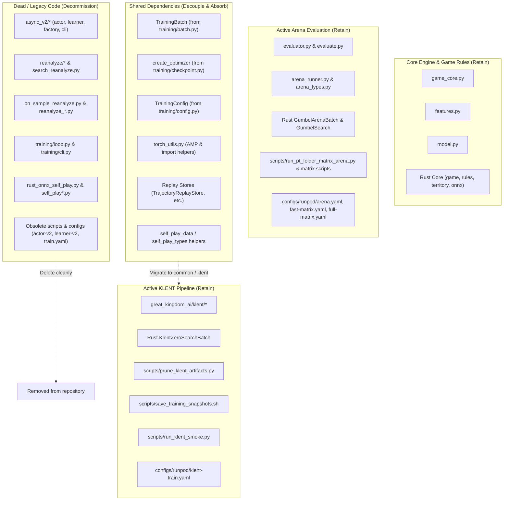
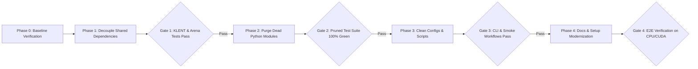

# Project Diet & Legacy Decommissioning Plan (Zero-Regression Specification)

## 1. Executive Summary & Goals

### 1.1 Background
The repository originally operated as an asynchronous AlphaZero-style actor-learner pipeline (Gumbel async v2) utilizing MCTS self-play, replay buffers, sample reanalysis, and multi-process orchestration. 

The architecture has now shifted to **KLENT (ICML 2026)**:
- **Synchronous single-process training pipeline** (`python -m great_kingdom_ai.klent.cli`) replacing detached actor/learner processes.
- **Zero-search self-play** in Rust (`KlentZeroSearchBatch`) with closed-form soft policy targets ($\pi'$) and $\lambda$-return value estimations.
- **Export compatibility**: Trained KLENT Q-head networks export two-output evaluation ONNX models where $V(s) = \langle \pi(\cdot\mid s), Q(\cdot\mid s) \rangle$, keeping full backward compatibility with the existing high-performance Rust Gumbel MCTS Arena evaluation engine.

### 1.2 Motivation
Large segments of the codebase remain dedicated to the retired Gumbel async v2 infrastructure, old training loops, legacy reanalysis workers, unused scripts, and outdated configuration files. Furthermore, operational documentation such as [`docs/runpod-klent-training.md`](runpod-klent-training.md) still contains historical comparisons, references to deprecated workers, and obsolete fallback paths.

### 1.3 Core Objectives
1. **Zero Functional Regression**: Absolutely no regression or performance degradation to:
   - Synchronous KLENT collection and training loop (`great_kingdom_ai/klent/`).
   - Rust zero-search self-play acceleration (`KlentZeroSearchBatch`).
   - ONNX export, dynamic batching, and parity verification (`export_klent_checkpoint_to_onnx`, `publish_klent_onnx`).
   - Gumbel MCTS Arena evaluation (`evaluator.py`, `arena_runner.py`, `run_pt_folder_matrix_arena.py`, `great-kingdom-evaluate`).
   - Core game rules, board logic, territory scoring, and feature generation (`great_kingdom_core`, `game_core.py`, `features.py`).
   - Operational artifact pruning and checkpoint snapshots (`prune_klent_artifacts.py`, `save_training_snapshots.sh`).
2. **Lean Codebase & Structural Clarity**: Adhere to the core coding rules in [`AGENTS.md`](../AGENTS.md):
   - Easy to test (*테스트가 용이한 구조*)
   - Easy to modify (*수정이 용이한 구조*)
   - Modular files without excessive size (*파일 하나가 쓸데없이 크지 않은 구조*)
3. **Streamlined Documentation**: Diet [`docs/runpod-klent-training.md`](runpod-klent-training.md) and [`scripts/setup_runpod.sh`](../scripts/setup_runpod.sh) to establish KLENT as the primary, authoritative standard without legacy clutter.

---

## 2. Component Inventory & Classification

To ensure surgical precision, every module and script is categorized into one of three buckets:
- **Category A: Retain & Protect** (Active core, KLENT pipeline, Arena evaluation)
- **Category B: Shared Dependencies** (Must be decoupled and absorbed before deleting legacy modules)
- **Category C: Dead / Legacy Candidates** (Safe for decommission and removal)



### 2.1 Category A: Retain & Protect (Active Production & Evaluation)
These components are critical to daily operation, CI/CD, and model evaluation:

| Component / Path | Role & Justification |
|---|---|
| `python/great_kingdom_ai/klent/*` | Core KLENT training pipeline (trainer, dataset, loss, targets, checkpoint, export, publish, pruning, rust_actor, types, shards). |
| `python/great_kingdom_ai/model.py` | Shared neural network backbone (`PolicyValueNetwork`), `strong_attn` preset, and Q-head projection (`action_value_head=True`). |
| `python/great_kingdom_ai/features.py` | 17-channel board feature extraction, legal action masking, 82-action space definitions. |
| `python/great_kingdom_ai/game_core.py` | Python wrapper around Rust engine (`great_kingdom_core`), providing Game, Board, and Arena batch bindings. |
| `python/great_kingdom_ai/onnx_export.py` & `onnx_precision.py` | PyTorch to ONNX export, FP16 conversion, ONNX Runtime execution, and numerical parity checks. |
| `python/great_kingdom_ai/config_io.py` | Safe YAML serialization and deserialization. |
| `python/great_kingdom_ai/evaluator.py` & `evaluate.py` | Core evaluation engine; manages Gumbel MCTS evaluations against PyTorch checkpoints and ONNX models. |
| `python/great_kingdom_ai/arena_runner.py` & `arena_types.py` | Orchestrates head-to-head arena games with opening temperature, paired seeds, and summary generation. |
| `rust/great_kingdom_core/src/klent/*` | Rust-native `KlentZeroSearchBatch` for ultra-fast, zero-search self-play collection. |
| `rust/great_kingdom_core/src/gumbel/*` | Rust `GumbelArenaBatch` and `GumbelSearch` used directly by Arena evaluation. |
| `rust/great_kingdom_core/src/{game,rules,territory,features,onnx}/*` | Rust engine core: rules, eye/territory detection, and ONNX Runtime session pools. |
| `scripts/prune_klent_artifacts.py` | Active artifact worker managing shard, checkpoint, and ONNX version lifecycle. |
| `scripts/save_training_snapshots.sh` | Periodic checkpoint snapshot creator. |
| `scripts/run_klent_smoke.py` | Fast CPU-based KLENT verification entry point. |
| `scripts/setup_runpod.sh` | Runpod PyTorch/CUDA environment setup, Rust extension build, and test verification. |
| `scripts/{run_pt_folder_matrix_arena.py, run_candidate_pairwise_matrix.py, find_strongest_candidate.py, analyze_arena_report.py, print_koth_winners.py, prune_candidate_snapshots.py, run_gumbel_setting_arena.py, run_snapshot_ordo_ranking.py}` | Comprehensive Arena and matrix evaluation toolset. |
| `configs/runpod/{klent-train.yaml, arena.yaml, fast-matrix.yaml, full-matrix.yaml}` | Active training and evaluation YAML specifications. |

---

### 2.2 Category B: Shared Dependencies Requiring Decoupling

KLENT was built as an extension within the existing repository, borrowing several utility classes from `great_kingdom_ai.training` and `great_kingdom_ai.replay`. **Deleting those packages prematurely would break KLENT.**

The exact dependencies and migration targets:

1. **`great_kingdom_ai/training/batch.py`**:
   - *Imported by*: `great_kingdom_ai/klent/loss.py` (`TrainingBatch`).
   - *Resolution*: Move `TrainingBatch` dataclass into `great_kingdom_ai/klent/types.py` or a dedicated lightweight `great_kingdom_ai/common/batch.py`.
2. **`great_kingdom_ai/training/checkpoint.py`**:
   - *Imported by*: `great_kingdom_ai/klent/checkpoint.py` (`create_optimizer`).
   - *Resolution*: Absorb `create_optimizer` (AdamW optimizer construction with weight-decay group filtering) directly into `great_kingdom_ai/klent/checkpoint.py` or `great_kingdom_ai/torch_utils.py`.
3. **`great_kingdom_ai/training/config.py`**:
   - *Imported by*: `great_kingdom_ai/klent/checkpoint.py` (`TrainingConfig`).
   - *Resolution*: KLENT defines its own `KlentTrainConfig`. Replace references to `TrainingConfig` with a lean `OptimizerConfig` or absorb needed fields directly.
4. **`great_kingdom_ai/training/torch_utils.py`**:
   - *Imported by*: `great_kingdom_ai/klent/checkpoint.py` (`_cuda_amp_enabled`, `_import_torch`).
   - *Resolution*: Move `torch_utils.py` to `great_kingdom_ai/torch_utils.py` (or keep inside `great_kingdom_ai/klent/_torch.py` where similar logic already resides).
5. **`great_kingdom_ai/replay/`**:
   - *Imported by*: `great_kingdom_ai/klent/dataset.py` and `rust_actor.py` (`TrajectoryReplayStore`, `TrajectoryArrayBatch`, `ReplaySample`, `TrajectoryEpisode`, `TrajectoryTransition`).
   - *Resolution*: The trajectory storage format (`.npz` with actions, rewards, features, legal_masks, policies, state_values) is very clean. Retain `replay/` as a lightweight data format package (`dataset.py`, `sample.py`, `schema.py`, `trajectory.py`), while pruning unused legacy files:
     - Remove `replay/terminal_board.py` (auxiliary loss terminal board).
     - Remove `replay/persistence.py` (old monolithic replay migration).
     - Remove `replay_diagnostics.py` and `replay_monitor.py`.
6. **`great_kingdom_ai/self_play_data.py` & `self_play_types.py`**:
   - *Imported by*: `great_kingdom_ai/klent/rust_actor.py` (`value_target_for_player`, `GameLog`, `MoveLog`).
   - *Resolution*: Retain these two small data-structure files, or migrate `GameLog`/`MoveLog` into `great_kingdom_ai/arena_types.py` / `klent/types.py`.

---

### 2.3 Category C: Dead / Legacy Candidates (Safe for Decommission)

The following modules, scripts, and configurations have zero usage in active KLENT training or active Arena evaluation:

#### Python Modules to Remove
- `great_kingdom_ai/async_v2/` (Entire directory: `actor.py`, `cli.py`, `config.py`, `factory.py`, `learner.py`, `metadata.py`, `paths.py`, `__init__.py`).
- `great_kingdom_ai/reanalyze/` (Entire directory: `builder.py`, `cli.py`, `config.py`, `snapshot.py`, `summary.py`, `__init__.py`, `__main__.py`).
- `great_kingdom_ai/on_sample_reanalyze.py`
- `great_kingdom_ai/search_reanalyze.py`
- `great_kingdom_ai/reanalyze_evaluator.py`
- `great_kingdom_ai/reanalyze_sampling.py`
- `great_kingdom_ai/reanalyze_targets.py`
- `great_kingdom_ai/training/loop.py` (Legacy AlphaZero training loop: `train_from_replay`, `train_step`).
- `great_kingdom_ai/training/cli.py` (Legacy training CLI: `great-kingdom-train`).
- `great_kingdom_ai/rust_onnx_self_play.py` (Legacy Gumbel MCTS self-play runner).
- `great_kingdom_ai/rust_onnx_replay.py`
- `great_kingdom_ai/self_play.py` (Legacy Python Gumbel/Random self-play).
- `great_kingdom_ai/self_play_runner.py` (Legacy MCTS self-play runner).
- `great_kingdom_ai/learner_prefetch.py`
- `great_kingdom_ai/pipeline_printer.py`
- `great_kingdom_ai/runpod_pruning.py` (Superseded by `great_kingdom_ai/klent/pruning.py`).
- `great_kingdom_ai/single_batch_overfit.py`
- `great_kingdom_ai/trajectory_targets.py`

#### Scripts to Remove
- `scripts/prune_runpod_artifacts.py` (Legacy async v2 pruning; replaced by `scripts/prune_klent_artifacts.py`).
- `scripts/diagnose_async_update_pressure.py`
- `scripts/diagnose_async_replay_value.py`
- `scripts/diagnose_trajectory_policy_targets.py`
- `scripts/reevaluate_trajectory_policy_targets.py`
- `scripts/run_m6_smoke.py` (Legacy M6 milestone test).
- `scripts/run_m8_train_smoke.py` (Legacy M8 milestone test).
- `scripts/compare_ema_decay_branches.py` (Legacy AlphaZero EMA experiment).
- `scripts/export_ema_weights.py` (Legacy AlphaZero EMA tool).

#### Configurations to Remove
- `configs/runpod/actor-v2.yaml`
- `configs/runpod/learner-v2.yaml`
- `configs/runpod/train.yaml`
- `configs/m8-train-smoke.yaml`

#### `pyproject.toml` Cleanup
Remove outdated entry point console scripts:
- Remove: `great-kingdom-actor-v2`
- Remove: `great-kingdom-learner-v2`
- Remove: `great-kingdom-init-async-v2`
- Remove: `great-kingdom-train`
- Remove: `great-kingdom-reanalyze`
- Retain: `great-kingdom-evaluate`
- Add: `great-kingdom-klent = "great_kingdom_ai.klent.cli:main"` (convenient direct CLI entry point).

#### Obsolete Tests to Remove
Once the underlying legacy modules are removed, corresponding unit tests must be cleaned up to maintain a green, relevant test suite:
- `tests/test_actor_learner_v2.py`
- `tests/test_reanalyze.py`
- `tests/test_on_sample_reanalyze.py`
- `tests/test_rust_onnx_self_play.py`
- `tests/test_rust_onnx_replay.py`
- `tests/test_rust_onnx_pipeline.py`
- `tests/test_self_play.py`
- `tests/test_self_play_data.py`
- `tests/test_learner_prefetch.py`
- `tests/test_prune_runpod_artifacts_script.py`
- `tests/test_diagnose_async_update_pressure_script.py`
- `tests/test_diagnose_trajectory_policy_targets_script.py`
- `tests/test_reevaluate_trajectory_policy_targets_script.py`
- `tests/test_compare_ema_decay_branches_script.py`
- `tests/test_export_ema_weights_script.py`
- `tests/test_single_batch_overfit.py`
- `tests/test_terminal_board_training.py`
- `tests/test_train.py`
- `tests/test_train_v2_pipeline.py`
- `tests/test_training_loop.py`
- `tests/test_training_cli.py`
- `tests/test_m6_smoke_config.py`
- `tests/test_mcts.py`
- `tests/test_migrate_monolithic_replay_to_shards_script.py`
- `tests/test_trajectory_replay_migration.py`

*(Note: All KLENT tests, model tests, ONNX tests, features tests, evaluator tests, and arena tests are retained and continue to pass 100%).*

---

## 3. Targeted Diet Plan for `docs/runpod-klent-training.md`

`docs/runpod-klent-training.md` is the central operational manual for Runpod training. However, it currently reads like a transitional migration document. It must be refined into a direct, lean operational guide.

### 3.1 Unnecessary Sections & Phrasings to Trim

1. **Lines 7–10 (Async v2 Contrast)**:
   - *Current*: "기존 Runpod 초기 설정은 Gumbel async v2용이다. KLENT는 하나의 프로세스에서 수집 → 학습 → 체크포인트·ONNX 공개를 반복한다. 별도의 async v2 factory, actor, learner를 실행할 필요가 없다."
   - *Action*: Cut out historical comparison. Simply state: "KLENT runs as a single unified process orchestrating collection, optimization, and artifact publication."
2. **Lines 36–39 (Torch Versioning History)**:
   - *Current*: Explanation about `ai` extra requiring `torch>=2.6` vs Runpod 2.4.
   - *Action*: Keep the practical instruction (`bash scripts/setup_runpod.sh`) and remove historical baggage.
3. **Line 183 (Gumbel Checkpoint Notice)**:
   - *Current*: "Gumbel 체크포인트는 KLENT strict resume 대상이 아니다."
   - *Action*: Delete; Gumbel async training is completely decommissioned.
4. **Lines 209–210 (Old Prune Script Contrast)**:
   - *Current*: "기존 scripts/prune_runpod_artifacts.py는 async v2 산출물용이므로 KLENT 전용 pruning 도구로 간주하지 않는다."
   - *Action*: Delete entirely. Introduce `scripts/prune_klent_artifacts.py` directly as the standard pruning worker.
5. **Lines 269–272 (Snapshot Script Default Path Fallback)**:
   - *Current*: Mentions that omitting arguments in `save_training_snapshots.sh` falls back to async v2 paths.
   - *Action*: Update `scripts/save_training_snapshots.sh` default paths to KLENT (`checkpoints/latest.pt`) and simplify documentation accordingly.
6. **Section 6 (Arena Evaluation with Legacy Models)**:
   - *Current*: Overly verbose passages detailing how to export legacy EMA `.pt` checkpoints to compare against KLENT.
   - *Action*: Condense to focus on standard evaluation workflows: evaluating KLENT checkpoints against baseline checkpoints or intra-experiment KLENT snapshots.

### 3.2 Accompanying Script Updates
- **`scripts/setup_runpod.sh` (Lines 268–275)**:
  - *Current*: Instructs users to run `great-kingdom-actor-v2` and `great-kingdom-learner-v2`, and prune with `prune_runpod_artifacts.py`.
  - *Action*: Update instructions to:
    ```bash
    # Run KLENT continuous training loop
    python -m great_kingdom_ai.klent.cli --config configs/runpod/klent-train.yaml --loop
    
    # Run artifact pruning worker
    python -m scripts.prune_klent_artifacts --work-dir data/runpod/klent-strong-attn --loop --delete
    ```
- **`docs/runpod-initial-training-config.md`**:
  - *Action*: Archive or remove this document as it specifies dead `actor-v2.yaml` / `learner-v2.yaml` configs.

---

## 4. Phased Step-by-Step Implementation Roadmap

To strictly guarantee zero regression, the refactoring is broken down into 5 sequential phases with explicit verification gates at each boundary.



### Phase 0: Baseline Record
1. Run complete pytest suite: verify 557 passing tests.
2. Run KLENT smoke test on CPU:
   `python -m scripts.run_klent_smoke --work-dir data/test-smoke --iterations 1 --max-games 4 --min-transitions 4`
3. Document exact import tree for `great_kingdom_ai.klent`.

---

### Phase 1: Decouple & Absorb Shared Dependencies
*Goal: Ensure `klent/` has zero dependencies on legacy modules scheduled for deletion.*

1. **Absorb `TrainingBatch`**:
   - Move `TrainingBatch` definition to `great_kingdom_ai/klent/types.py`.
   - Update `great_kingdom_ai/klent/loss.py` to import `TrainingBatch` locally.
2. **Absorb `create_optimizer` & Optimizer Utilities**:
   - Transfer `create_optimizer` from `great_kingdom_ai/training/checkpoint.py` into `great_kingdom_ai/klent/checkpoint.py`.
   - Ensure handling of weight decay filtering (`decay_params`, `no_decay_params`) is self-contained.
3. **Decouple `torch_utils`**:
   - Move `_cuda_amp_enabled` and `_import_torch` into `great_kingdom_ai/klent/_torch.py`.
4. **Isolate Clean Replay Schemas**:
   - Keep `TrajectoryReplayStore`, `TrajectoryArrayBatch`, and `ReplaySample` cleanly in `great_kingdom_ai/replay/`.
   - Strip any dependencies in `replay/` pointing to `training/loop.py` or reanalysis modules.
5. **Decouple Actor Log Types**:
   - Ensure `GameLog` and `MoveLog` in `self_play_types.py` are isolated and clean.

**Verification Gate 1**:
- Run `pytest tests/test_klent_*.py tests/test_model.py tests/test_onnx_*.py tests/test_evaluate.py`.
- Run CPU smoke test: `python -m scripts.run_klent_smoke ...`
- Confirm all 11 KLENT test suites pass with zero warnings or broken imports.

---

### Phase 2: Purge Dead Python Modules & Obsolete Test Files
*Goal: Remove all non-functional and legacy code safely.*

1. **Delete Dead Python Directories**:
   - `rm -rf python/great_kingdom_ai/async_v2`
   - `rm -rf python/great_kingdom_ai/reanalyze`
2. **Delete Dead Python Files**:
   - `rm python/great_kingdom_ai/on_sample_reanalyze.py`
   - `rm python/great_kingdom_ai/search_reanalyze.py`
   - `rm python/great_kingdom_ai/reanalyze_*.py`
   - `rm python/great_kingdom_ai/training/loop.py`
   - `rm python/great_kingdom_ai/training/cli.py`
   - `rm python/great_kingdom_ai/rust_onnx_self_play.py`
   - `rm python/great_kingdom_ai/rust_onnx_replay.py`
   - `rm python/great_kingdom_ai/self_play.py`
   - `rm python/great_kingdom_ai/self_play_runner.py`
   - `rm python/great_kingdom_ai/learner_prefetch.py`
   - `rm python/great_kingdom_ai/pipeline_printer.py`
   - `rm python/great_kingdom_ai/runpod_pruning.py`
   - `rm python/great_kingdom_ai/single_batch_overfit.py`
   - `rm python/great_kingdom_ai/trajectory_targets.py`
3. **Delete Obsolete Tests**:
   - Remove the 24 legacy test files listed in Section 2.3.
4. **Update `pyproject.toml`**:
   - Strip removed console scripts.
   - Add `great-kingdom-klent = "great_kingdom_ai.klent.cli:main"`.

**Verification Gate 2**:
- Run `pytest`. All remaining active tests (~300+ tests covering KLENT, Model, ONNX, Features, Evaluator, Arena, and Pruning) must pass cleanly with 0 failures.
- Run `git status` to verify no needed files were accidentally deleted.

---

### Phase 3: Purge Obsolete Scripts and Configs
*Goal: Remove misleading configurations and deprecated utility scripts.*

1. **Delete Obsolete Scripts**:
   - `rm scripts/prune_runpod_artifacts.py`
   - `rm scripts/diagnose_async_*.py`
   - `rm scripts/diagnose_trajectory_policy_targets.py`
   - `rm scripts/reevaluate_trajectory_policy_targets.py`
   - `rm scripts/run_m6_smoke.py`
   - `rm scripts/run_m8_train_smoke.py`
   - `rm scripts/compare_ema_decay_branches.py`
   - `rm scripts/export_ema_weights.py`
2. **Delete Obsolete Configs**:
   - `rm configs/runpod/actor-v2.yaml`
   - `rm configs/runpod/learner-v2.yaml`
   - `rm configs/runpod/train.yaml`
   - `rm configs/m8-train-smoke.yaml`
3. **Update `scripts/save_training_snapshots.sh`**:
   - Set default source checkpoint to `checkpoints/latest.pt` instead of async v2 paths.

**Verification Gate 3**:
- Verify all retained scripts execute `--help` without import errors:
  - `python -m scripts.prune_klent_artifacts --help`
  - `python -m scripts.run_pt_folder_matrix_arena --help`
  - `python -m scripts.analyze_arena_report --help`
  - `python -m scripts.run_klent_smoke --help`
  - `great-kingdom-evaluate --help`
  - `great-kingdom-klent --help`

---

### Phase 4: Modernize Documentation & Setup Scripts
*Goal: Provide authoritative, clean instructions for local and Runpod workflows.*

1. **Diet `docs/runpod-klent-training.md`**:
   - Apply edits detailed in Section 3.1.
   - Remove legacy contrastive phrasing.
   - Clarify continuous training with `--loop` and pruning with `prune_klent_artifacts.py`.
2. **Update `scripts/setup_runpod.sh`**:
   - Replace legacy final output message (lines 268–275) with direct KLENT training and pruning commands.
3. **Archive/Clean `docs/runpod-initial-training-config.md`**:
   - Remove or mark as archived, directing users to `runpod-klent-training.md` and `configs/runpod/klent-train.yaml`.

**Verification Gate 4**:
- Check markdown links using link checker or inspection.
- Ensure all file references in documentation point to existing files.

---

### Phase 5: Rust Crate Diet & Final Certification
*Goal: Inspect Rust crate for unused legacy exports and run end-to-end certification.*

1. **Inspect Rust Exports**:
   - In `rust/great_kingdom_core/src/lib.rs`:
     - Keep `KlentZeroSearchBatch` (essential for KLENT).
     - Keep `GumbelArenaBatch` & `GumbelSearch` (essential for Arena evaluation).
     - Remove `GumbelSelfPlayBatch` if no longer referenced anywhere in Python.
2. **Build and Test Rust**:
   - `cargo test --manifest-path rust/great_kingdom_core/Cargo.toml`
   - `maturin develop --release`

**Verification Gate 5 (Full E2E Certification)**:
1. `pytest`: 100% passing on Python test suite.
2. `cargo test`: 100% passing on Rust test suite.
3. `run_klent_smoke`: Collects transitions, trains 1 epoch, saves checkpoint, verifies loss is finite.
4. `arena test`: Run 2-game evaluation via `great-kingdom-evaluate --backend pytorch` to ensure Gumbel MCTS arena functions flawlessly.

---

## 5. Risk Assessment & Safeguard Matrix

| Risk / Failure Mode | Likelihood | Impact | Built-in Safeguard in Plan |
|---|:---:|:---:|---|
| **Accidental removal of optimizer logic** | Medium | Critical | Phase 1 explicitly absorbs `create_optimizer` into `klent/checkpoint.py` with standalone unit testing before deleting `training/`. |
| **Breaking Arena evaluation** | High | Critical | Arena evaluation (`evaluator.py`, `arena_runner.py`, `GumbelArenaBatch`, `run_pt_folder_matrix_arena.py`) is categorized as **Category A (Protected)**. `eval.onnx` contract is strictly preserved. |
| **Breaking shard storage format** | Low | Critical | `TrajectoryReplayStore` and `.npz` structures are preserved intact in `replay/`. No changes to array keys or layouts. |
| **Breaking Runpod setup script** | Low | High | `setup_runpod.sh` retains all CUDA/Rust compile flags; only legacy echo commands at the very bottom are modernized. |
| **Broken imports across repository** | Medium | Medium | Each phase is followed by automated `pytest` and AST import sweeps to catch broken imports immediately. |

---

## 6. Definition of Done (DoD)

The diet and cleanup process is deemed complete when:
- [ ] No module references `async_v2`, `reanalyze`, or legacy training loops.
- [ ] `pyproject.toml` contains only active console entry points (`great-kingdom-evaluate`, `great-kingdom-klent`).
- [ ] `docs/runpod-klent-training.md` is clean, concise, and focused solely on KLENT.
- [ ] `pytest` runs without error, with zero failed tests.
- [ ] `scripts/run_klent_smoke.py` succeeds end-to-end on CPU.
- [ ] `scripts/run_pt_folder_matrix_arena.py` runs successfully on test checkpoints.
- [ ] Rust extension builds cleanly with `extension-module,onnx-cuda`.
- [ ] Repository size, file count, and cognitive load are significantly reduced, fully meeting the guidelines in `AGENTS.md`.
